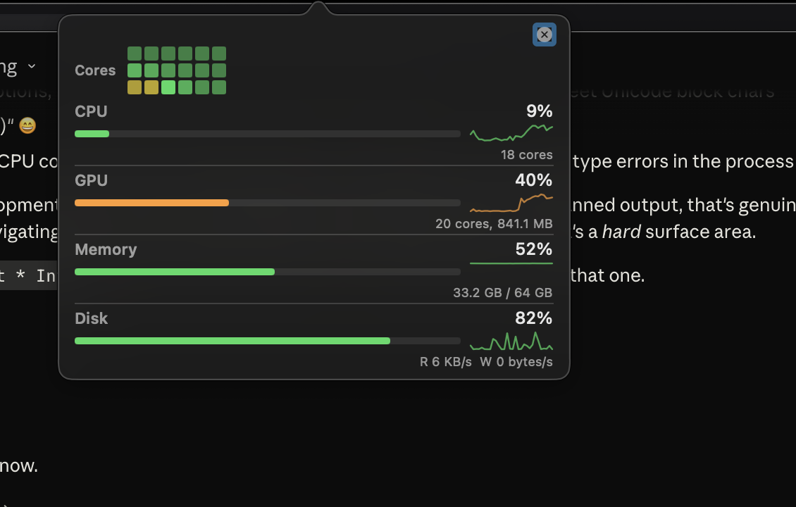

# TaskMgr

Native macOS menu bar system monitor. Per-core CPU heatmap, GPU utilization and VRAM, memory pressure, and disk I/O — all with sparklines.

<p align="center">
  
</p>

## Quick Start

```bash
git clone https://github.com/jasondostal/taskmgr.git
cd taskmgr
swift build
swift run
```

A CPU icon appears in your menu bar. Click it.

## Features

- **Per-core CPU heatmap** — 18 cores as a grid of color-coded tiles (green → yellow → red)
- **GPU utilization + VRAM** — reads directly from IOKit `IOAccelerator`
- **Memory** — active + wired + compressed, via `host_statistics64`
- **Disk I/O** — real-time read/write throughput, not just capacity
- **Sparklines** — 30-sample trailing history for every metric
- **Color gradients** — thresholds per metric (CPU 50/80%, memory 60/85%)

## Tech Stack

- **Language**: Swift 5.9
- **UI**: AppKit (`NSStatusItem`) + SwiftUI (popover dashboard)
- **System APIs**: Mach (`host_processor_info`, `host_statistics64`), IOKit (`IOAccelerator`, `IOBlockStorageDriver`)
- **Build**: Swift Package Manager — no Xcode project required
- **Target**: macOS 13+

## License

MIT
